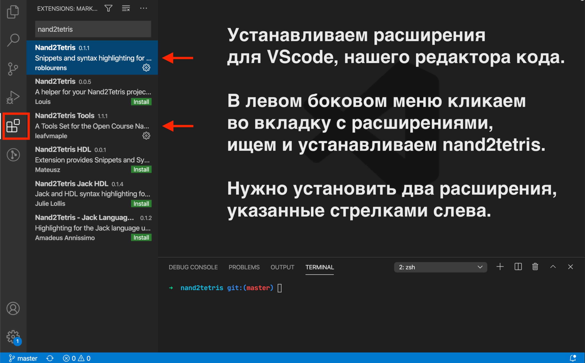
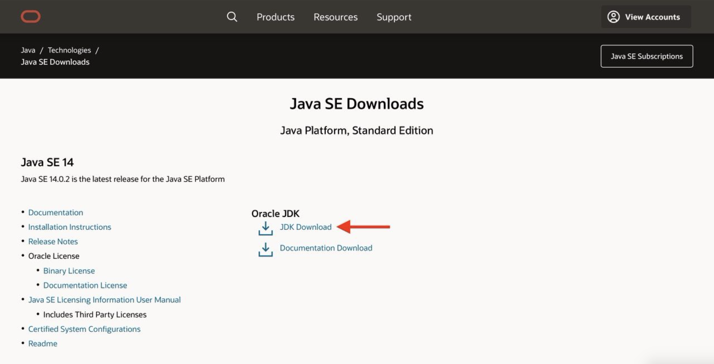

# Устройство и программирование компьютера 🧮 🏗 💻

Задачи для самостоятельной практики в рамках обучающей программы — [sukharev.io](https://www.sukharev.io)

## Настройка окружения

Чтобы решать задачи — нужно писать программы. Чтобы компьютер мог выполнить эти программы — нужно настроить для него окружение.

_Настройка состоит из двух шагов:_

1. Установите **редактор кода**, чтобы писать в нем программы. Редактор кода — это такая же программа, как ворд. **Ворд** редактирует **текст**. **Редактор** кода редактирует **код**.
2. Установите **Java Development Kit** (JDK), чтобы запустить симулятор железа компьютера. Симулятор в котором собирается компьютер написан на языке программирования Java. JDK — это программа, которая позволяет выполнять код, написанный на языке программирования Java.

## Редактор кода

[Установите редактор кода — VSCode](https://code.visualstudio.com/download)

Далее, откройте VSCode и установите расширения Nand2Tetris. Картинка-инструкция ниже.

## JDK

- Установите JDK (предпочтительно 14 версию) — [https://www.oracle.com/java/technologies/javase-downloads.html](https://www.oracle.com/java/technologies/javase-downloads.html). Сайт официальный. Картинка-инструкция ниже:

Скачиваем JDK 14 версии.

## Задачи

После настройки скачайте zip архив с задачами.

В архиве 12 проектов. В каждом проекте хранятся практические задания. Один проект — это один уровень абстракции строения компьютерной системы. В папках проекта в файлах README.md описаны подробные инструкции по выполнению проекта. Когда открываете какую-то папку — сразу смотрите, есть ли в папке README инструкция.

Ниже картинка, как скачать архив.

## Лицензия

Задачи доступны по лицензии [Creative Common Attribution-NonCommercial-ShareAlike 3.0 Unported License](https://creativecommons.org/licenses/by-nc-sa/3.0/) в рамках учебника «The Elements of Computing Systems» и проекта nand2tetris. Спасибо авторам — Ноаму Нисану (Noam Nisan) и Шимону Шокену (Shimon Schocken) ❤️
