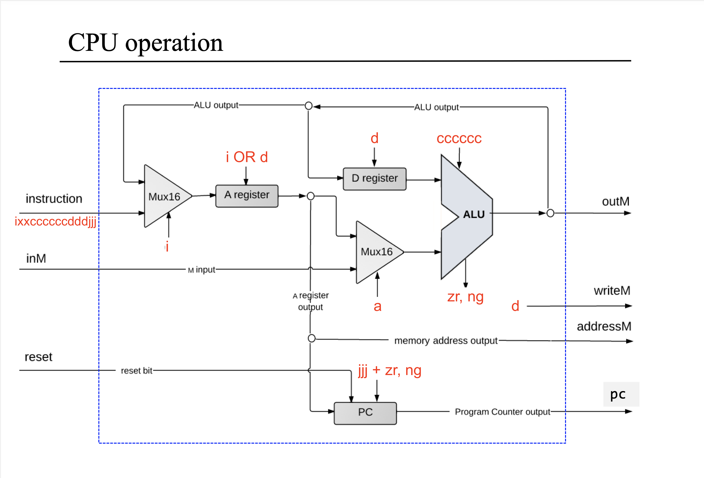
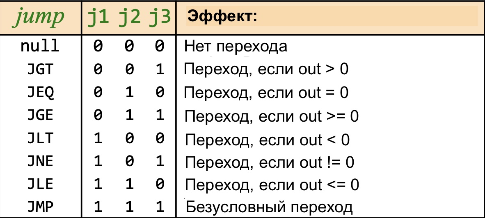

<!-- Если читаете файл в VSCode — нажмите ctrl+shift+v, чтобы включить режим просмотра. Для macOS — cmd+shift+v. -->

# Процессор

**Инпуты:**

- instruction — инструкция, приходит из памяти
- inM — данные, приходят из памяти
- reset — сброс программного счетчика до 0

**Аутпуты:**

- outM — данные, сохраняются в память
- writeM — бит записи в память, работает как load бит в регистре
- addressM — адрес активного регистра в памяти, куда записывается или откуда читается значение
- pc — аутпут программного счетчика

## Реализация

Процессор состоит из двух локальных регистров (A и D), программного счетчика и АЛУ. Программный счетчик отвечает за получение инструкций из памяти. АЛУ выполняет вычисления. Локальный регистр D хранит данные. Локальный регистр А тоже хранит данные, но еще используется для адресации RAM и выполнения переходов.

Задача процессора выполнять программы. Программа состоит из инструкций. Процессор получает инструкцию в `instruction` инпуте и выполняет ее. Инструкции 16-битные. Формат инструкции: `ixxaccccccdddjjj`.

Инструкция разделяется на отдельные биты: `i`, `xx`, `a`, `cccccc`, `ddd`, `jjj`. Биты передаются в инпуты регистров, АЛУ и программного счетчика, это хорошо видно на схеме процессора. Например, биты `cccccc` передаются в `zx, nx, zy, ny, f, no` инпуты АЛУ. Бит `i` определяет тип выполняемой инструкции: 0 кодирует инструкцию А; 1 кодирует инструкцию C.

Сначала рассмотрим каждый компонент процессора. А затем перейдем к типам инструкций.

## Регистр D

Регистр D выполняет одну задачу — хранит данные.

**Инпуты.** Инпут `in` регистра D подключается к аутпуту АЛУ. Бит `load` регистра управляется одним из `d` битов инструкции C.

**Аутпуты.** Аутпут регистра D подключается к первому инпуту АЛУ.

## Регистр А

Регистр А выполняет три задачи: (1) хранит данные, (2) используется для адресации RAM, (3) указывает адрес перехода программного счетчика.

**Инпуты.** Инпут `in` регистра А подключается к мультиплексору. Инпут `А` мультиплексора — `instruction` инпут процессора; инпут `B` мультиплексора — аутпут АЛУ; бит `sel` мультиплексора — `i` бит инструкции. Бит `load` регистра А — один из `d` битов инструкции. Если выполняется инструкция А, `load` бит регистра — `i` бит инструкции.

**Аутпуты.** Аутпут регистра А подключается к: (1) `addressM` аутпуту процессора, (2) первому инпуту мультиплексора перед АЛУ, (3) `in` инпуту программного счетчика.

## АЛУ

АЛУ выполняет арифметические и логические операции над значениями в локальных регистрах и в активном регистре RAM.

**Инпуты.** `А` (первый) инпут АЛУ — регистр D. `B` (второй) инпут АЛУ — аутпут мультиплексора. А инпут мультиплексора — аутпут регистра А; `B` инпут мультиплексора — `inM` инпут процессора. Бит `sel` мультиплексора — `a` бит инструкции. Биты `zx, nx, zy, ny, f, no` — `cccccc` биты инструкции.

**Аутпуты.** Аутпут АЛУ подключается к инпуту `in` регистра A и инпуту `in` регистра D. Аутпут-флаги (`zr`, `ng`) вместе с `j` битами инструкции используются в управлении `load` инпутом программного счетчика.

## Программный счетчик

Программный счетчик (PC) отвечает за получение следующей инструкции из памяти.

**Инпуты.** Инпут `in` счетчика подключается к аутпуту регистра А. Бит `reset` PC — инпут `reset` процессора. Бит `load` управляется `j` битами инструкции и аутпут-флагами (`zr`, `ng`) АЛУ.

**Аутпуты.** Аутпут `out` счетчика — аутпут `pc` процессора.

### Как используется программный счетчик

Аутпут программного счетчика подключается к `address` инпуту памяти инструкций (ROM). Аутпут ROM подключен к `instruction` инпуту процессора. Счетчик увеличивается: 1, 2, 3, 4, 5, … — процессор последовательно получает инструкции из ROM в `instruction` инпуте.

### Переходы

Еще счетчик умеет выполнять переходы. Переходы бывают условные и безусловные. Переход — это переключение счетчика на определенную инструкцию, например, с шестой инструкции сразу на двадцатую или пятнадцатую, какую захотите. Переход выполняется, когда значение в счетчике переключают через `in` инпут и `load=1` бит. Инпут `in` подключается к аутпуту регистра А, так регистр А определяет номер инструкции к которой происходит переход. Бит `load` счетчика управляется `j` битами инструкции вместе с аутпут-флагами (`zr`, `ng`) АЛУ. Биты `j` указывают условие перехода, аутпут-флаги АЛУ используются для проверки этого условия. Если условие выполняется — значение в программном счетчике перезаписывается значением из регистра А и происходит условный переход. Безусловный переход происходит, когда все три бита `jjj` равны `111` соответственно.

## Инструкции

Мы рассмотрели все компоненты процессора в отдельности. Теперь поговорим об инструкциях.

Процессор поддерживает два типа инструкций: A и C. Инструкции 16-битные. Формат инструкций: ixxaccccccdddjjj. Бит `i` определяет тип инструкции: 0 кодирует инструкцию А; 1 кодирует инструкцию C.

### Инструкция А

Инструкция А записывает 15-битное число в регистр А.

Формат: 0xxaccccccdddjjj, где xxaccccccdddjjj — 15-битное число.

Примеры инструкции А:

- `0110100100110101`: записать в регистр А число 26933.
- `0001101011111100`: записать в регистр А число 6908.
- `0110101010101011`: записать в регистр А число 27307.

### Инструкция С

Инструкция С выполняет вычисление в АЛУ с сохранением результата в локальный регистр (A или D) или один из регистров RAM (M). Еще инструкция C выполняет условный или безусловный переход. Обычно делается что-то одно: или вычисление в АЛУ, или переход.

Формат: 1xxaccccccdddjjj, где:

- `xx` биты — не используются, всегда равны `11`.
- `a` бит — управляет `sel` битом мультиплексора перед АЛУ.
- `cccccc` биты — `zx, nx, zy, ny, f, no` биты АЛУ.
- `ddd` биты — управляют `load` битами локальных регистров и `writeM` инпутом RAM.
- `jjj` биты — вместе с аутпут-флагами АЛУ управляют `load` битом программного счетчика.

## Задача

[Соберите процессор](CPU.hdl)
