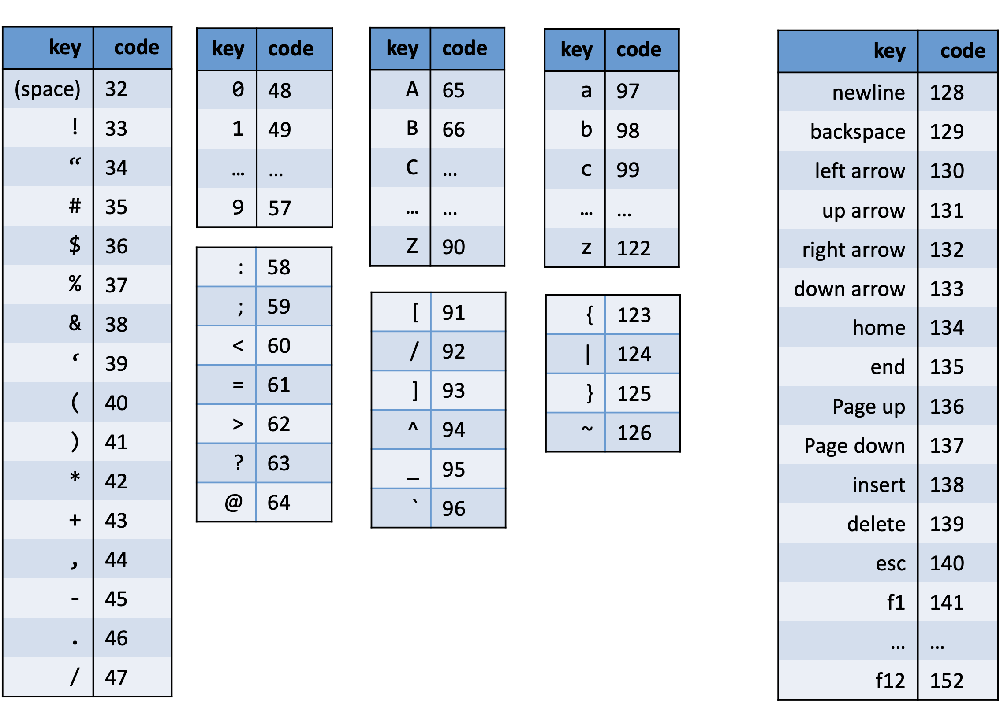
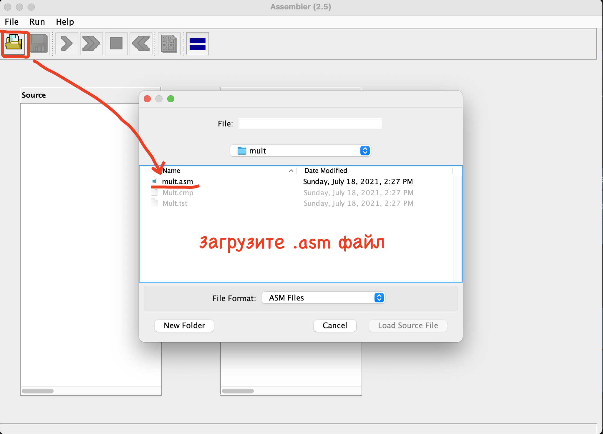
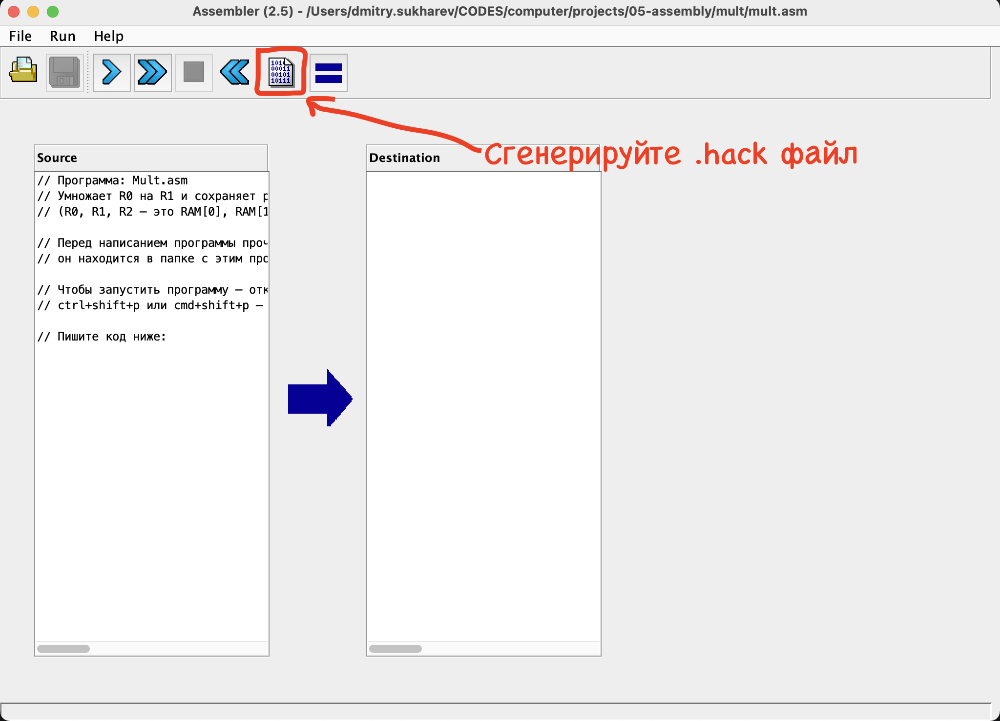
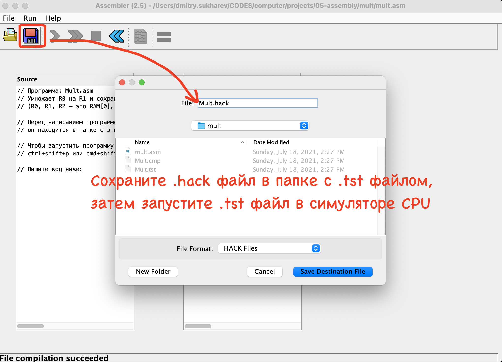
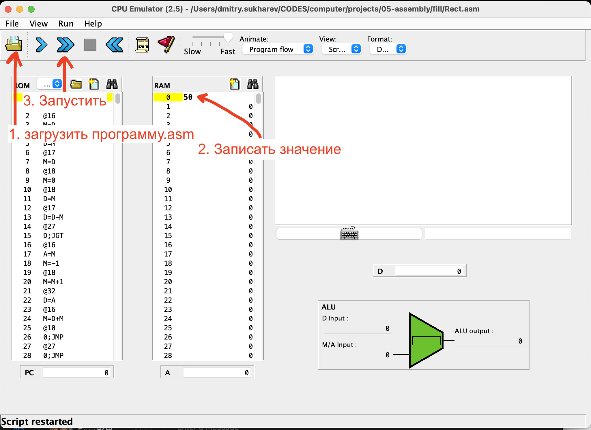
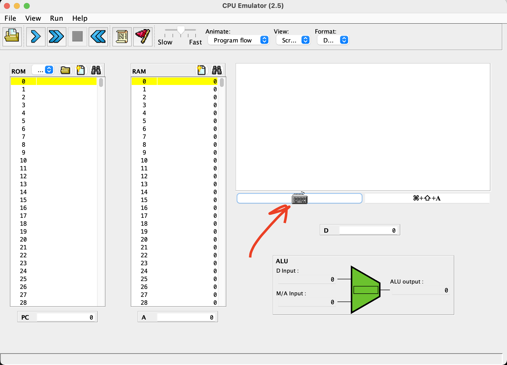
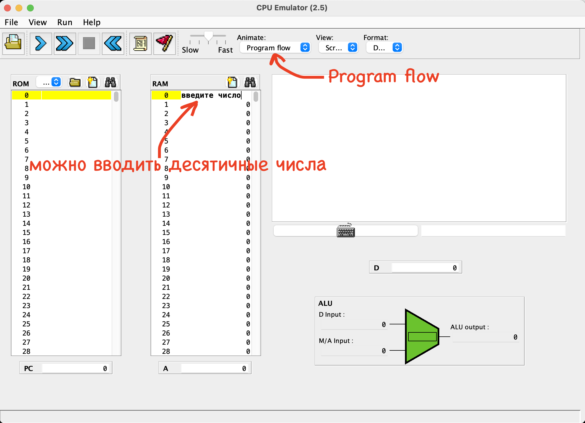

<!-- Если читаете файл в VSCode — нажмите ctrl+shift+v, чтобы включить режим просмотра. Для macOS — cmd+shift+v. -->

# Язык ассемблера

В прошлом проекте мы собрали процессор. В этом проекте мы будем программировать этот процессор на собственном языке ассемблера.

Наш язык ассемблера поддерживает два типа инструкций: А и C. Рассмотрим их подробнее.

## Инструкция А (address)

Инструкция А отвечает за адресацию RAM и ROM памяти и сохранение в регистр А 15-битного значения.

Пример инструкции А: `@791` — записать в регистр А число 791.

Еще пример: `@812` — записать в регистр А число 812.

Когда вы записываете какое-то число в регистр А, происходит два побочных действия:

1. активируется регистр RAM[A] для записи/чтения, об этом чуть позже.
2. PC `in` инпут становится равен значению в регистре А. То есть, значение в регистре А становится указателем на инструкцию при осуществлении перехода.

## Инструкция С (compute)

Инструкция C отвечает за выполнение арифметико-логических операций в АЛУ и сохранение результата в один из регистров: A, D, M. A и D — это локальные регистры; регистр M – это активный RAM регистр.

Адресация регистра M происходит через регистр А: `M = RAM[A]`. То есть, если хотите прочитать значение из RAM[17] — нужно записать число 17 в регистр А и обратиться к регистру M, вот так:

```c
// записываем RAM[17] в регистр D
@17 // A=17
D=M // D=RAM[A]
```

Если хотите записать значение в RAM[99] — нужно записать 99 в регистр А и аналогично чтению обратиться к регистру M, вот так:

```c
// сохраняем 10 в регистр RAM[99]
@10 // A=10
D=A // D=10
@99 // A=99
M=D // RAM[99]=10
```

## Переменные

Переменные хранят данные.

Пример использования переменной:

```c
// сохраняем число 100 в переменную variable
@100 // A=100
D=A // D=100
@variable
M=D // variable=100 (сохранили в переменную variable число 100)
```

В примере выше мы сохранили значение 100 в переменную. Мы также могли сохранить значение в любой из RAM регистров, просто по адресу, но запоминать адреса регистров сложнее, поэтому используются переменные. Запомнить, что в переменной `sum` лежит сумма двух чисел проще, чем вспоминать адрес регистра в который вы эту сумму сохранили, особенно, когда таких регистров много.

### Предустановленные переменные

В нашем языке ассемблера есть двадцать три предустановленные переменные, их можно использовать без объявления. Вот они:

1. `R0` — по умолчанию установлена в значение 0
2. `R1` — по умолчанию установлена в 1
3. `R2` — установлена в 2
4. `R3` — установлена в 3
5. …
6. `R15` — установлена в 15
7. `SP` — установлена в 0
8. `LCL` — установлена в 1
9. `ARG` — установлена в 2
10. `THIS` — установлена в 3
11. `THAT` — установлена в 4
12. `SCREEN` — установлена в 16384 (это начало I/O регистров экрана)
13. `KBD` — установлена в 24576 (это I/O регистр клавиатуры)

Обратите внимание на переменные `SCREEN` и `KBD`, они нужны для взаимодействия с устройствами ввода/вывода — экраном и клавиатурой. Переменная `SCREEN` хранит адрес первого I/O регистра экрана. Регистры экрана начинаются с 16384 регистра и заканчиваются на 24575 регистре включительно. Переменная `KBD` хранит адрес регистра клавиатуры — 24576.

Переменные `SP`, `LCL`, `ARG`, `THIS`, `THAT` подробнее рассматриваются в следующих проектах.

## Переходы

Еще инструкция С отвечает за выполнение переходов. Если хотите перейти к 15-ой инструкции (или любой другой) — записываете 15 в регистр А и через инструкцию С выполняете переход, вот так:

```c
@15   // A=15
0;JMP // безусловный переход к 15-ой инструкции
```

Рассмотрим примеры переходов в полноценной программе:

```c
// Программа: Signum.asm
// Вычисляет: если (R0 > 0) R1=1
//            иначе R1=0
// Использование: запишите значение в RAM[0],
//                смотрите результат в RAM[1]
@R0    // A = 0
D=M    // D = RAM[0]
@8     // A = 8
D;JGT  // условный переход: если (D > 0) переходим к 8 инструкции
@R1    // A = 1
M=0    // иначе RAM[1]=0
@10    // A = 10
0;JMP  // безусловный переход к 10 инструкции
@R1    // A = 1
M=1    // RAM[1] = 1
@10    // A = 10
0;JMP  // безусловный переход к 10 инструкции
```

В примере программы выше условный переход происходит на четвертой строке `D;JGT`, а указатель на инструкцию к которой осуществляется переход, указан на третьей строке `@8`: если значение в регистре R0 больше нуля происходит переход к 8-ой инструкции.

Еще переходы осуществляются на 7-ой и 11-ой инструкциях. Там происходит переход к 10-ой инструкции.


## Лейблы

Лейблы позволяют удобнее осуществлять переходы. Без лейблов переход осуществляется по номеру строки на которой расположена нужная инструкция. С лейблами переход осуществляется по лейблу.

Рассмотрим пример программы из последнего примера выше, но с лейблами:

```c
// Программа: Signum.asm
// Вычисляет: если (R0 > 0) R1=1
//            иначе R1=0
// Использование: запишите значение в RAM[0],
//                смотрите результат в RAM[1]
@R0    // A = 0
D=M    // D = RAM[0]
@POSITIVE
D;JGT  // условный переход: если (D > 0) переходим к лейблу POSITIVE
@R1    // A = 1
M=0    // иначе RAM[1] = 0
@END
0;JMP  // безусловный переход к лейблу end
(POSITIVE) // лейбл POSITIVE
@R1
M=1    // RAM[1]=1
(END)  // лейбл END
@END
0;JMP  // безусловный переход к лейблу end
```

Видите, мы убрали переходы по номеру строки и стали переходить к лейблам. Это удобнее, так исчезает привязка программы к номерам строк.

## Системы ввода/вывода

Системы ввода/вывода (input/output — I/O) используются для подключению к компьютеру периферийных устройств: клавиатуры, мыши, принтера, экрана и других.

Один из методов связи с периферийными устройствами называется «вводом/выводом, отображенным в память» (memory-mapped I/O, MMIO).

В MMIO процессор получает доступ к периферийным устройствам через оперативную память. Мышь, клавиатура и другие устройства занимают часть адресного пространства в RAM. В нашем компьютере адреса с 16384 регистра по 24575 регистр выделены под экран, а 24576 регистр выделен под клавиатуру. Запись и чтение из I/O регистров происходит точно так же, как с обыкновенными регистрами.

Подробнее рассмотрим отображенные в память клавиатуру и экран.

### Клавиатура

Когда нажимаете клавишу на клавиатуре в 24576 регистр записывается скан-код (scan-code) клавиши, которую вы нажали. Хотите узнать какую клавишу нажал пользователь — читаете значение из регистра 24576, вот так:

```c
@KBD // A=24576
D=M // D=RAM[24576]=scan_code
```

Вот таблица всех скан-кодов клавиатуры:



### Экран

У нас черно-белый экран 512x256 пикселей.

I/O регистры экрана занимают адреса с 16384 регистр по 24575 регистр.

Чтобы закрасить весь экран в черный, нужно записать `1111111111111111` во все I/O регистры экрана.

В следующих проектах мы научимся рисовать на экране графику, пока достаточно научиться закрашивать весь экран в черный.

## Примеры кода

```c
// D=10
@10
D=A
```

```c
// D++
D=D+1
```

```c
// D=RAM[17]
@17
D=M
```

```c
// RAM[17]=D
@17
M=D
```

```c
// RAM[17]=10
@10
D=A
@17
M=D
```

```c
// RAM[5] = RAM[3]
@3
D=M
@5
M=D
```

## Примеры программ

```c
// Программа: Flip.asm
// меняет местами значения в регистрах
// RAM[0] и RAM[1]
// Использование: запишите в RAM[0] и RAM[1] числа,
//                запустите программу и числа поменяются местами
@R1 // A=1
D=M // D=RAM[1]
@temp
M=D // temp = R1 (сохранили в переменную temp значение из RAM[1])
@R0 // A=0
D=M // D=RAM[0]
@R1 // A=1
M=D // R1 = R0
@temp
D=M // D=temp (сохранили в регистр D значение из переменной temp)
@R0 // A=0
M=D // R0=temp
(END) // лейбл END: бесконечный цикл
@END
0;JMP
```

```c
// Программа: Add2.asm
// Вычисляет: RAM[2] = RAM[0] + RAM[1]
// Использование: запишите значения в RAM[0] и RAM[1],
//                смотрите результат в RAM[2]
@0
D=M   // D = RAM[0]
@1
D=D+M // D = D + RAM[1]
@2
M=D   // RAM[2] = D
```

```c
// Программа: Signum.asm
// Вычисляет: если (R0 > 0) R1=1
//            иначе R1=0
// Использование: запишите значение в RAM[0],
//                смотрите результат в RAM[1]
@R0
D=M    // D = RAM[0]
@POSITIVE
D;JGT  // если (R0>0) переходим к лейблу POSITIVE
@R1
M=0    // иначе R1=RAM[1]=0
@END
0;JMP  // goto end
(POSITIVE) // лейбл POSITIVE
@R1
M=1    // R1=RAM[1]=1
(END)  // лейбл END
@END
0;JMP
```

```c
// Программа: Sum1toN.asm
// Вычисляет: RAM[1] = 1+2+ ... +n
// Использование: запишите значение n в RAM[0],
//                смотрите результат в RAM[1]
@R0
D=M
@n
M=D   // n = R0
@i
M=1   // i = 1
@sum
M=0   // sum = 0
(LOOP)
@i
D=M
@n
D=D-M
@STOP
D;JGT  // если (i > n) переходим к лейблу STOP
@sum
D=M
@i
D=D+M
@sum
M=D    // sum = sum + i
@i
M=M+1  // i = i + 1
@LOOP
0;JMP
(STOP)
@sum
D=M
@R1
M=D    // RAM[1] = sum
(END)
@END
0;JMP
```

```c
// Программа: Rect.asm
// Рисует черный прямоугольник
// в верхнем левом углу экрана
// ширина 16 пикселей, высота
// RAM[0] пикселей.
// Использование: запишите значение
// (высоту прямоугольника) в RAM[0].
@SCREEN // A = 16384
D=A
@addr
M=D // addr = 16384 (инициализируем переменную addr)
@0
D=M // D = RAM[0]
@n
M=D // n = RAM[0]
@i
M=0 // i = 0 (инициализируем переменную i)
(LOOP)
@i
D=M
@n
D=D-M
@END
D;JGT // если (i > n) переходим к лейблу END
@addr
A=M
M=-1 // RAM[addr]=1111111111111111
@i
M=M+1 // i=i+1
@32
D=A
@addr
M=D+M // addr = addr + 32 (переход на следующую строку)
@LOOP
0;JMP // goto LOOP

(END) // конец программы
@END
0;JMP // бесконечный цикл
```

## Задача

Напишите две программы: [Mult.asm](mult/mult.asm) и [Fill.asm](fill/Fill.asm). Программы находятся в соответствующих папках mult и fill в этом проекте.

Программа `mult.asm` — умножает два числа.

Программа `fill.asm` — закрашивает экран в черный, когда вы нажимаете клавишу на клавиатуре.

### Как запустить программу

Чтобы запустить программу (`fill.asm` или `mult.asm`) и проверить правильно ли вы ее написали, нужно:

1. С помощью ассемблера перевести код на языке ассемблера (.asm) в машинный код (.hack).
2. Запустить машинный код в симуляторе процессора.

#### Первый шаг: переводим код на языке ассемблера в машинный код

1. Загрузите соответствующий `.asm` файл в ассемблер.
2. Ассемблер открывается через меню команд: `ctrl+shift+p` или `cmd+shift+p` для macOS: `Nand2Tetris: Open Assembler Simulator`.
3. Сгенерируйте `.hack` файл.
4. Сгенерированный `.hack` файл нужно назвать, как `.asm` файл, если файл называется `Mult.asm`, то сгенерированный файл должен называться `Mult.hack`, большие/маленькие буквы имеют значение.
5. Сохраните сгенерированный `.hack` файл в папку с `.asm` файлом.







#### Второй шаг: запускаем машинный код в симуляторе процессора

1. Загрузите в симулятор процессора соответствующий тестовый файл (`fill.tst` или `mult.tst`).
2. Симулятор процессора открывается через меню команд: `ctrl+shift+p` или `cmd+shift+p` для macOS: `Nand2Tetris: Open CPU Simulator`.
3. Тестовые файлы загружаются через кнопку с иконкой свитка. После загрузки тестового файла, `.hack` файл запуститься автоматически.
4. Чтобы запустить программу нажмите на кнопку с иконкой двух стрелок (не забудьте переключить опцию `Animate` в значение `no animation`).

Если у программы нет тестового файла, например вы хотите посмотреть, как работает программа `Rect.asm` в папке `/fill`, тогда загружайте в симулятор сам `Rect.hack` файл и запускайте программу без тестового файла. Файлы `.hack` загружаются через кнопку с иконкой папки.



### Как пользоваться клавиатурой

Чтобы использовать клавиатуру нажмите на кнопку с изображением клавиатуры, ввод с клавиатуры включится и вы сможете нажимать на клавиши. Скан-коды будут записываться в 24576 регистр.



### Установка значений в память

Вы можете установить значение в память. Для этого кликните на RAM регистр и введите в него значение.

Значения устанавливаются только, когда опция `Animate` установлена в значение `Program flow`.

После установки значений в память, не забудьте переключить опцию `Animate` на `no animation`, так программа выполняется быстрее.


