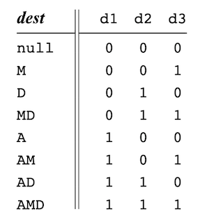
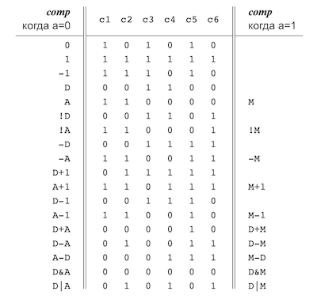
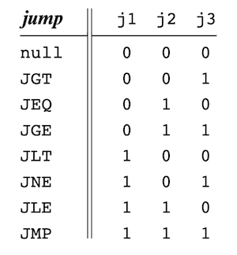
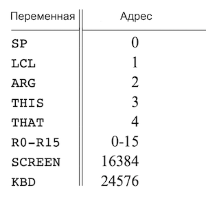

<!-- Если читаете файл в VSCode — нажмите ctrl+shift+v, чтобы включить режим просмотра. Для macOS — cmd+shift+v. -->

# Ассемблер

На вход ассемблер получает файл с кодом на языке ассемблера `file.asm`. На выходе ассемблер создает файл с машинным кодом `file.hack`.

## Инструкции

Язык ассемблера поддерживает два типа инструкций: A и C.

### Инструкция А

Код на языке ассемблера: `@value`, где `value` десятичное число.

Код на машинном языке: `0vvvvvvvvvvvvvvv`, где v 1 или 0. Пятнадцать бит `vvvvvvvvvvvvvvv` — это двоичное число.

### Инструкция С

Код на языке ассемблера: `dest = comp ; jump`. Примеры: `M=D+1`, `D;JGT`.

Код на машинном языке: `111accccccdddjjj`, где `acccccc` — comp биты, `ddd` — dest биты, `jjj` — jump биты.

### Часть dest инструкции С



### Часть comp инструкции С



### Часть jump инструкции С



## Предустановленные переменные



## Пример перевода .asm файла в .hack файл

```c
@i      // переводится в 0000000000010000
M=1     // переводится в 1110111111001000
@sum    // 0000000000010001
M=0     // 1110101010001000
(LOOP)  // лейбл LOOP не переводится
@i      // 0000000000010000
D=M     // 1111110000010000
@100    // 0000000001100100
D=D-A   // 1110010011010000
@END    // 0000000000010010
D;JGT   // 1110001100000001
@i      // 0000000000010000
D=M     // 1111110000010000
@sum    // 0000000000010001
M=D+M   // 1111000010001000
@i      // 0000000000010000
M=M+1   // 1111110111001000
@LOOP   // 0000000000000100
0;JMP   // 1110101010000111
(END)   // лейбл END не переводится
@END    // 0000000000010010
0;JMP   // 1110101010000111
```

## Задача

Напишите ассемблер на любом языке программирования. Ассемблер должен быть CLI программой и использоваться через терминал.

Переведите `.asm` файлы в этом проекте в `.hack` файлы.

Запустите `.hack` файлы в симуляторе процессора.

Начинайте проверять ассемблер с файлов с буквой `L` в конце, в них нет символов: `MaxL.asm`, `PongL.asm`, `RectL.asm`. Когда напишите ассемблер, который умеет переводить файлы без символов, добавьте функциональность перевода символов. Поддержку символов можно проверить на файлах: `Add.asm`, `Max.asm`, `Pong.asm`, `Rect.asm`.

## Как проверить, что ваш ассемблер работает

Откройте уже написанный ассемблер в меню команд: `Nand2Tetris > Open Assembler Simulator`. Нажмите `Load Source File` и загрузите `.asm` файл, который переводите в машинный код. Затем нажмите `Load Comparison File`, чтобы загрузить `.hack` файл, который создали с помощью своего ассемблера. Затем нажмите `Fast Translation`, чтобы сравнить свой машинный код с правильным переводом.


